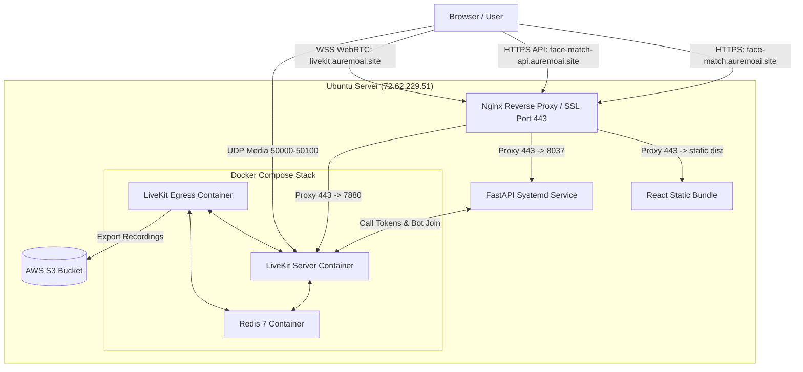

# AI KYC Liveness Detection & Face Verification — Production Deployment Master Hub

Welcome to the production deployment guide for the **AI KYC Verification System**. This repository contains a full-stack, real-time video verification and liveness detection platform composed of four core service layers:

1. **React Web Dashboard** (Vite + Tailwind CSS)
2. **FastAPI Backend API** (Python, MediaPipe, InsightFace, OpenCV)
3. **LiveKit WebRTC Infrastructure Stack** (LiveKit Server + Redis + LiveKit Egress in Docker)
4. **Nginx Reverse Proxy & Certbot** (HTTPS & WSS SSL Encryption)

---

## 1. Multi-Service Architecture Overview



---

## 2. Port & Domain Mapping Matrix

| Service | Public Domain / Port | Internal Port / Target | Technology | Description |
| :--- | :--- | :--- | :--- | :--- |
| **Frontend Web App** | `https://face-match.auremoai.site` | `/var/www/html/face-match/frontend/dist` | React / Nginx | User & Officer Web Application |
| **Backend API** | `https://face-match-api.auremoai.site` | `http://127.0.0.1:8037` | FastAPI / Uvicorn | Liveness, Embeddings & Call API |
| **LiveKit Signaling** | `wss://livekit.auremoai.site` | `http://127.0.0.1:7880` | LiveKit / Docker | WebRTC Signaling & Room Service |
| **LiveKit RTC TCP** | `7881 / TCP` | `7881 / TCP` | LiveKit Server | WebRTC TCP Fallback Connection |
| **LiveKit Media UDP**| `50000-50100 / UDP` | `50000-50100 / UDP` | LiveKit Server | WebRTC Audio/Video Stream Transport |
| **Redis Cache** | Internal / localhost | `6379 / TCP` | Redis 7 Container | Room state & Egress queue |

---

## 3. Deployment Guides Directory

Detailed step-by-step documentation is modularized into dedicated guides:

* 📘 **[Docker & LiveKit Infrastructure Guide](deployment-docker-services.md)**: Deployment and configuration of Docker Compose, Redis, LiveKit Server, LiveKit Egress, UFW firewall, and LiveKit SSL setup.
* 📗 **[FastAPI Backend API Deployment Guide](deployment-backend.md)**: Environment setup, MediaPipe & InsightFace model weights, Systemd service unit, and Nginx backend proxy setup.
* 📙 **[React Frontend Deployment Guide](deployment-frontend.md)**: Node.js setup, Vite production compilation, static asset serving, and Nginx SSL setup for single-page applications (SPA).

---

## 4. Environment File Matrix

The repository provides `.env.example` (for local development) and `.env.production` (for server deployment) templates at both root backend and frontend levels:

| Location | Template File | Production Target File | Purpose |
| :--- | :--- | :--- | :--- |
| **Backend Root** | [`.env.example`](.env.example) | [`.env.production`](.env.production) -> `.env` | Controls database paths, InsightFace home, CORS origins, LiveKit API keys & AWS S3 credentials |
| **Frontend Directory** | [`frontend/.env.example`](frontend/.env.example) | [`frontend/.env.production`](frontend/.env.production) -> `frontend/.env` | Controls `VITE_API_URL`, `VITE_API_TIMEOUT`, and `VITE_LIVEKIT_URL` for build compilation |

---

## 5. Master Deployment Sequence (Quick-Start)

Follow this order when launching the system on a fresh Ubuntu server:

### Step 1: System Packages & Directories
```bash
sudo apt update && sudo apt install -y nginx git curl python3-pip python3-venv certbot python3-certbot-nginx
sudo mkdir -p /var/www/html/face-match/data
sudo chown -R $USER:www-data /var/www/html/face-match
```

### Step 2: Clone Repository & Configure `.env`
```bash
git clone <your-repo-url> /var/www/html/face-match
cd /var/www/html/face-match

# Set up backend environment
cp .env.production .env

# Set up frontend environment
cp frontend/.env.production frontend/.env
```

### Step 3: Launch Docker Infrastructure Services
```bash
# Follow deployment-docker-services.md
docker compose up -d
```

### Step 4: Configure & Start FastAPI Backend
```bash
# Follow deployment-backend.md
python3 -m venv .venv
source .venv/bin/activate
pip install -r requirements.txt
wget -O models/face_landmarker.task https://storage.googleapis.com/mediapipe-models/face_landmarker/face_landmarker/float16/1/face_landmarker.task

sudo cp deployment-backend-service /etc/systemd/system/face-match-backend.service # or create systemd unit
sudo systemctl daemon-reload && sudo systemctl enable --now face-match-backend
```

### Step 5: Build React Frontend
```bash
# Follow deployment-frontend.md
cd /var/www/html/face-match/frontend
npm install
npm run build
```

### Step 6: Configure Firewall & SSL Certificates via Certbot
```bash
# Allow UFW Ports
sudo ufw allow 80/tcp
sudo ufw allow 443/tcp
sudo ufw allow 7880/tcp
sudo ufw allow 7881/tcp
sudo ufw allow 50000:50100/udp

# Obtain Certificates
sudo certbot certonly --nginx -d face-match.auremoai.site
sudo certbot certonly --nginx -d face-match-api.auremoai.site
sudo certbot certonly --nginx -d livekit.auremoai.site

# Enable Nginx sites and restart
sudo nginx -t && sudo systemctl restart nginx
```